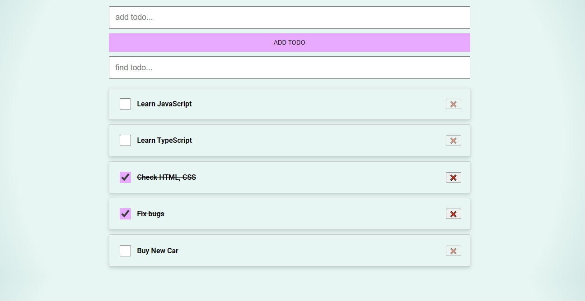

# TODO application (MVC)
[RUN APPLICATION](https://dmitrykolotilshikov.github.io/todo-application-mvc)


## TODO application MVC (Model, View, Controller)

```
    TODO application (HTML | CSS | JavaScript) 
    Application written in OOP style.
    Using Functions as Utilities
```

## TODO приложение MVC (Модель, Представление, Контроллер)

```
    Приложение написано на (HTML | CSS | JavaScript) в ООП стиле
    ООП подход. Функции используются как утилиты
```



---
© [Dmitry Kolotilshikov](https://github.com/DmitryKolotilshikov)

